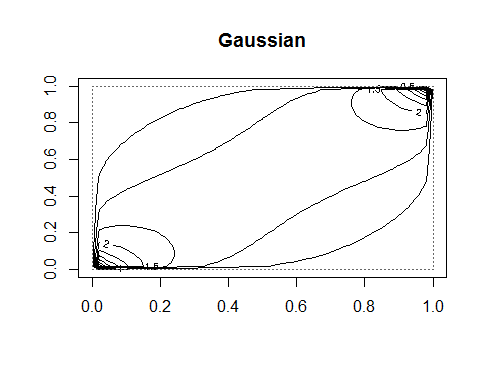
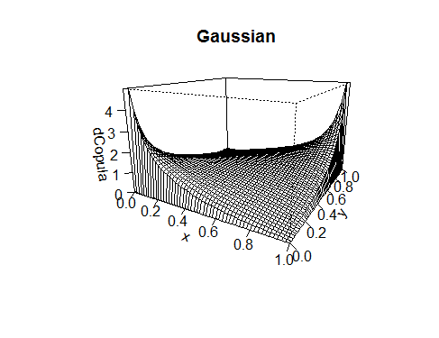
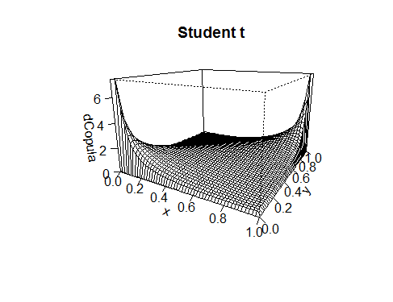
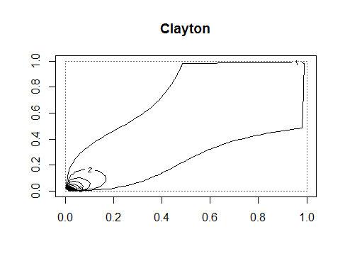
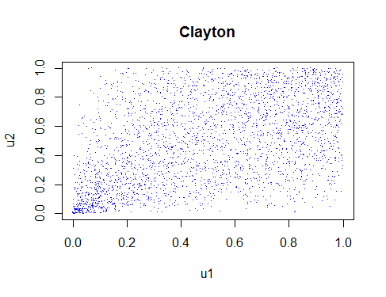
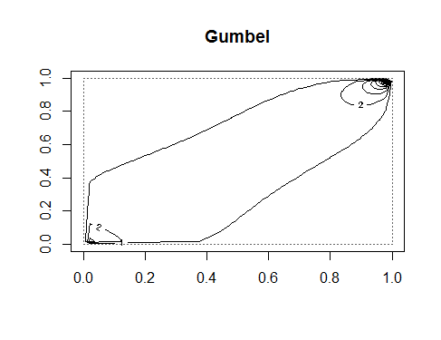
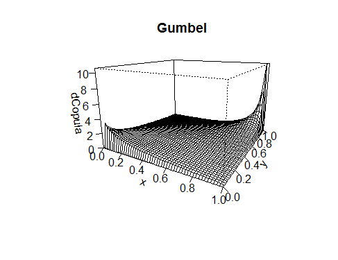
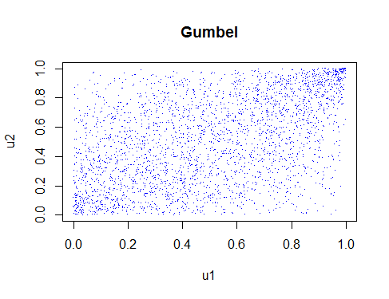

[](http://quantlet.de/index.php?p=info)

## [](http://quantlet.de/) **XFGCopula_stock** [](http://quantlet.de/d3/ia)

```yaml

Name of QuantLet: XFGCopula_stock

Published in: has not been published

Description: 'Uses four types of copula (Gaussian, t, Clayton and Gumbel) to fit returns 
of 10 Internet and Software stocks in S&P500 (time period: 2015/05/01-2016/04/25), computes 
the Kendall''s tau, Spearman''s rho and tail dependence matrix of corresponding estimated copula. 
Simulates these four types of copula and creates contour plot, perspective plot and 
scatter plot for each copula.'

Keywords: copula, Gaussian, Student t, Clayton, Gumbel

Author: Jinhua Yang

Datafile: stock10.csv

Input: Prices of 10 Internet and Software stocks in S&P500 (time period: 2015/05/01-2016/04/25)

Output: 'Kendall''s tau, Spearman''s rho and tail dependence matrix contour plot, perspective 
plot and scatter plot for each simulated copula'

```

           
         
             
               


```r

# clear history
rm(list = ls(all = TRUE))
graphics.off()

#setwd("D:...") set working directory

# import data
stock = read.csv("stock10.csv", header = T, sep = ",")

# get daily return of each stock
price = stock[, 2:11]
value = matrix(stock[, 12], nrow = T)
T = nrow(price)
n = ncol(price)
return = log(price[2, ]/price[1, ])
for (j in 2:(T - 1)) {
    return[j, ] = log(price[j + 1, ]/price[j, ])
}
T = nrow(return)

# install.packages('VineCopula') libraries = c('VineCopula', 'copula', 'scales',
# 'scatterplot3d') install.packages('matrixStats')
library("tseries")
library("VineCopula")
library("copula")
library("matrixStats")


# standardization
return = as.matrix(return)
mean = as.matrix(colMeans(return))
mean = t((mean[, 1]))
meanmatrix = matrix(rep(mean, T), ncol = ncol(mean), byrow = TRUE)
demean = return - meanmatrix

std = matrix(rep(0), nrow = T, ncol = 10)
for (i in 1:10) {
    value = fitted.values(garch(demean[, i], order = c(1, 1), series = NULL))
    std[, i] = value[, 1]
}

residuals = demean[2:247, ]/std[2:247, ]

rmean = as.matrix(colMeans(residuals))
rstd = as.matrix(colSds(residuals))


# correlation parameter estimates(rho) using Gaussian Copula

normrho = matrix(rep(0), nrow = 10, ncol = 10)

for (i in 1:10) {
    normrho[i, i] = 1
    for (j in (i + 1):10) {
        # empitical cdf
        u = pobs(cbind(residuals[, i], residuals[, j]))
        # esimating normal copula
        set.seed(10)
        normfit = fitCopula(normalCopula(dim = 2), u, method = "ml")
        normrho[i, j] = unname(coef(normfit))
        normrho[j, i] = normrho[i, j]
        
    }
}

# correlation parameter estimates(rho and df) using T Copula

trho = matrix(rep(0), nrow = 10, ncol = 10)
tdf = matrix(rep(0), nrow = 10, ncol = 10)

for (i in 1:10) {
    trho[i, i] = 1
    for (j in (i + 1):10) {
        # empitical cdf
        u = pobs(cbind(residuals[, i], residuals[, j]))
        # esitmating t copula
        set.seed(10)
        tfit = fitCopula(tCopula(dim = 2), u, method = "ml")
        trho[i, j] = unname(coef(tfit)[1])
        tdf[i, j] = unname(coef(tfit)[2])
        trho[j, i] = trho[i, j]
        
    }
}

# correlation parameter estimates(delta and Kendall''s tau) using Clayton Copula

delta_clay = matrix(rep(0), nrow = 10, ncol = 10)
tau_clay = matrix(rep(0), nrow = 10, ncol = 10)
tail_Lower = matrix(rep(0), nrow = 10, ncol = 10)

for (i in 1:10) {
    delta_clay[i, i] = 999
    tau_clay[i, i] = 1
    tail_Lower[i, i] = 1
    for (j in (i + 1):10) {
        # empitical cdf
        u = pobs(cbind(residuals[, i], residuals[, j]))
        # esitmating clayton copula
        set.seed(10)
        clayfit = fitCopula(claytonCopula(dim = 2), u, method = "ml")
        
        delta_clay[i, j] = unname(coef(clayfit))
        delta_clay[j, i] = delta_clay[i, j]
        
        tau_clay[i, j] = delta_clay[i, j]/(delta_clay[i, j] + 2)
        tau_clay[j, i] = tau_clay[i, j]
        
        tail_Lower[i, j] = 2^(-1/delta_clay[i, j])
        tail_Lower[j, i] = tail_Lower[i, j]
        
    }
}

# correlation parameter estimates(delta and Kendall''s tau) using Gumbel Copula

delta_gum = matrix(rep(0), nrow = 10, ncol = 10)
tau_gum = matrix(rep(0), nrow = 10, ncol = 10)
tail_upper = matrix(rep(0), nrow = 10, ncol = 10)

for (i in 1:10) {
    delta_gum[i, i] = 999
    tau_gum[i, i] = 1
    tail_upper[i, i] = 1
    for (j in (i + 1):10) {
        # empitical cdf
        u = pobs(cbind(residuals[, i], residuals[, j]))
        # esitmating clayton copula
        set.seed(10)
        gumfit = fitCopula(gumbelCopula(dim = 2), u, method = "ml")
        
        delta_gum[i, j] = unname(coef(gumfit))
        delta_gum[j, i] = delta_gum[i, j]
        
        tau_gum[i, j] = delta_gum[i, j]/(delta_gum[i, j] + 2)
        tau_gum[j, i] = tau_gum[i, j]
        
        tail_upper[i, j] = 2^(1/delta_gum[i, j])
        tail_upper[j, i] = tail_upper[i, j]
        
    }
}

# copula simulation

# Create a contour plot, a perspective plot and a scatter plot for the Gaussian Copula
contour(normalCopula(dim = 2, normrho[1, 2]), dCopula, main = "Gaussian")
persp(normalCopula(dim = 2, normrho[1, 2]), dCopula, phi = 15, theta = 30, main = "Gaussian")
u1 = rCopula(3000, normalCopula(dim = 2, normrho[1, 2]))
plot(u1[, 1], u1[, 2], pch = ".", col = "blue", main = "Gaussian", xlab = "u1", ylab = "u2")
cor(u1, method = "spearman")

# Create a contour plot,a perspective plot and a scatter plot for the t Copula
contour(tCopula(trho[1, 2], dim = 2, df = tdf[1, 2]), dCopula, main = "Student t")
persp(tCopula(dim = 2, trho[1, 2], df = tdf[1, 2]), dCopula, phi = 15, theta = 30, main = "Student t")
u2 = rCopula(3000, tCopula(dim = 2, trho[1, 2], df = tdf[1, 2]))
plot(u2[, 1], u2[, 2], pch = ".", col = "blue", main = "Student t", xlab = "u1", ylab = "u2")  
cor(u2, method = "spearman")

# Create a contour plot,a perspective plot and a scatter plot for the Clayton Copula
contour(claytonCopula(delta_clay[1, 2], dim = 2), dCopula, main = "Clayton")
persp(claytonCopula(dim = 2, delta_clay[1, 2]), dCopula, phi = 15, theta = 30, main = "Clayton")
u3 = rCopula(3000, claytonCopula(dim = 2, delta_clay[1, 2]))
plot(u3[, 1], u3[, 2], pch = ".", col = "blue", main = "Clayton", xlab = "u1", ylab = "u2")
cor(u3, method = "spearman")

# Create a contour plot,a perspective plot and a scatter plot for the Gumbel Copula
contour(gumbelCopula(delta_gum[1, 2], dim = 2), dCopula, main = "Gumbel")
persp(gumbelCopula(dim = 2, delta_gum[1, 2]), dCopula, phi = 15, theta = 30, main = "Gumbel")
u3 = rCopula(3000, gumbelCopula(dim = 2, delta_gum[1, 2]))
plot(u3[, 1], u3[, 2], pch = ".", col = "blue", main = "Gumbel", xlab = "u1", ylab = "u2")
cor(u3, method = "spearman")


# compute portfolio VaR using simulation of Gaussian copula
normrho1 = c(normrho[1, 2:10], normrho[2, 3:10], normrho[3, 4:10], normrho[4, 5:10], normrho[5, 
    6:10], normrho[6, 7:10], normrho[7, 8:10], normrho[8, 9:10], normrho[9, 10])
a = normalCopula(param = normrho1, dim = 10, dispstr = "un")
simunorm = rCopula(1000, copula = a)
b = qnorm(simunorm, mean = 0, sd = 1)
c = b + matrix(rep(mean, 1000), ncol = ncol(mean), byrow = TRUE)
portfolio = c %*% W
PVaRnorm = quantile(portfolio, probs = c(0.01, 0.05))

```
